# 💎 Appointments Tracker PRO: The Intelligent Facility OS

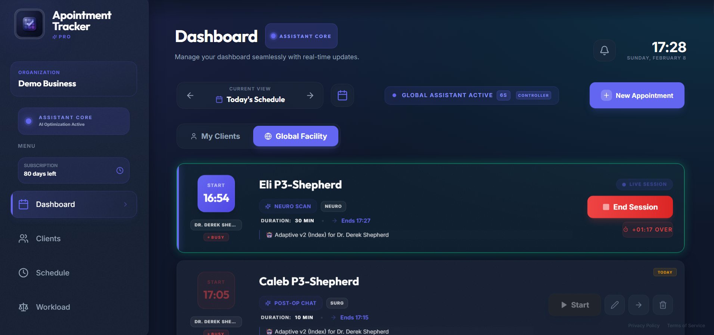

Welcome to the future of high-intensity facility management. **Appointments Tracker PRO** is not just a calendar; it is a **Workload Intelligence Engine** built for elite medical clinics, high-end salons, and busy professional centers.

This platform was engineered to solve the "static scheduling" problem, replacing rigid booking blocks with a living, breathing ecosystem that predicts delays, suggests load-balancing, and optimizes human capital in real-time.

---

## 📽️ Visual Showcase
*Note: To see the full visual impact, ensure you view the screenshots in the `docs/screenshots` folder.*

### 🚀 Intelligent Dashboard
The command center for your business. Monitor live sessions, track exact delays (e.g., "+01:17 OVER"), and manage your facility from a single, glass-morphic interface.


### 📊 Workload Balancer (The Pulse)
The mathematical heart of the system. It tracks your "Floor Capacity" and "System Load." When a provider is overwhelmed, the **Crisis Mode** engine predicts overtime and suggests movement of specific clients to free providers.
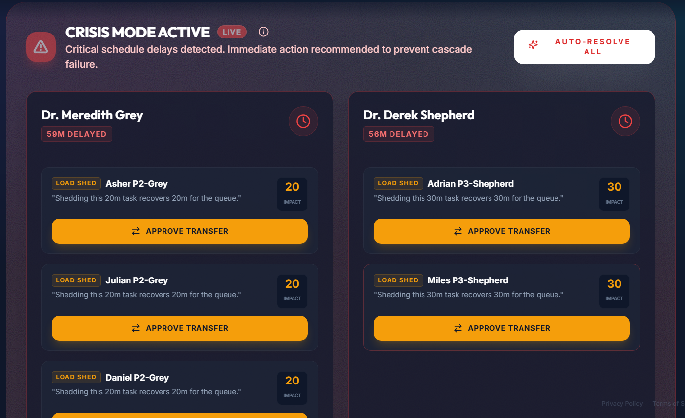

### 🤖 Smart Autopilot
The system's AI layer that identifies optimal re-assignments to fix delays automatically. It presents a list of solutions that can be approved with a single click.
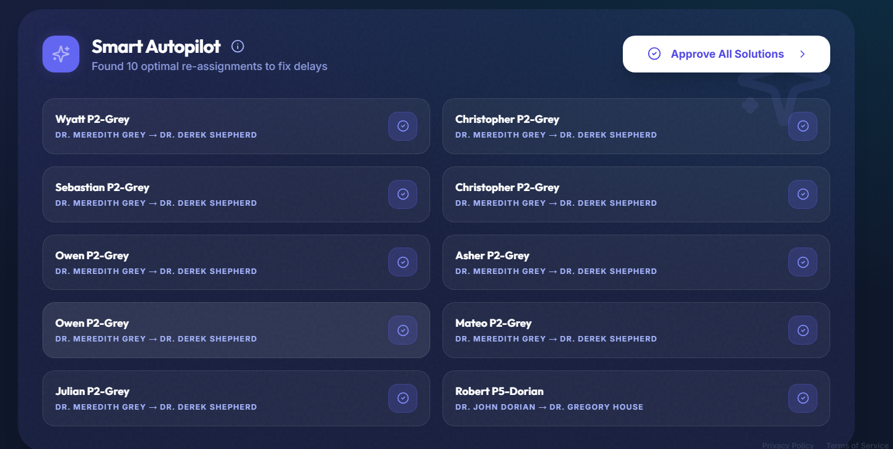

### 📈 Financial Intelligence & Activity Logs
Deep dive into your revenue analytics. Track daily, weekly, and monthly income alongside performance metrics like "On-Time Ratio" and "Delay Frequency." Every operational action is recorded in the high-fidelity Activity Log.
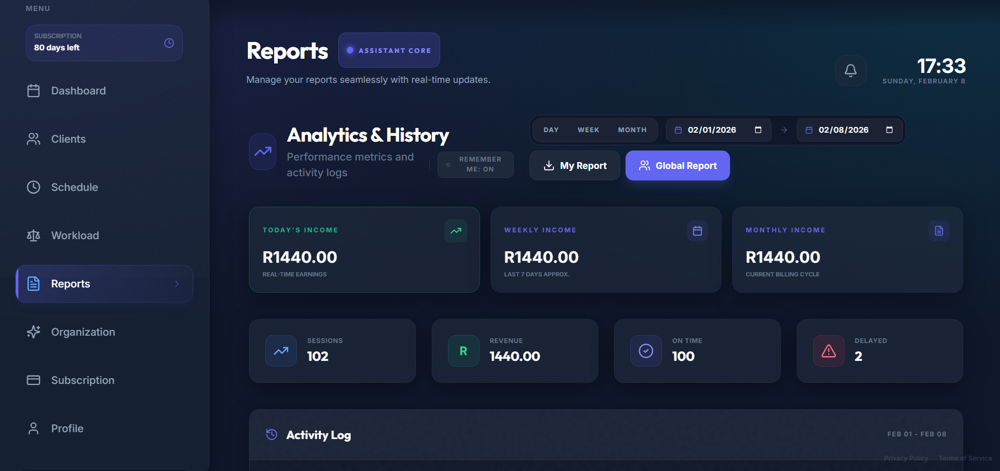
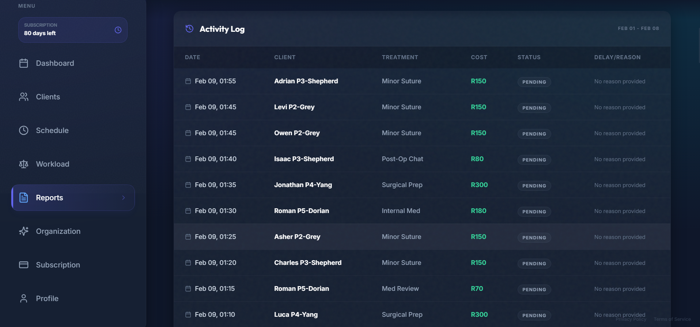

### 👥 Client & Team Management
Manage your client database with a clean, grid-based card system. Add new clients quickly with a sleek modal interface and manage your organizational team members in one place.
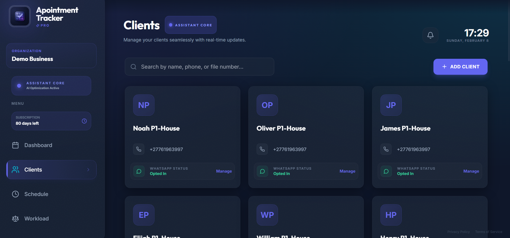
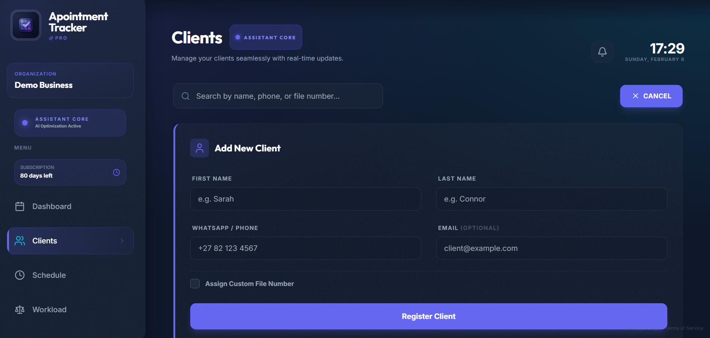
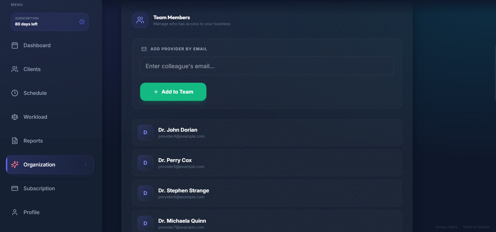

### 📅 Advanced Scheduling & Capacity Controls
Define facility availability, recurring break slots, and buffer times between appointments to prevent staff burnout and ensure operational efficiency.
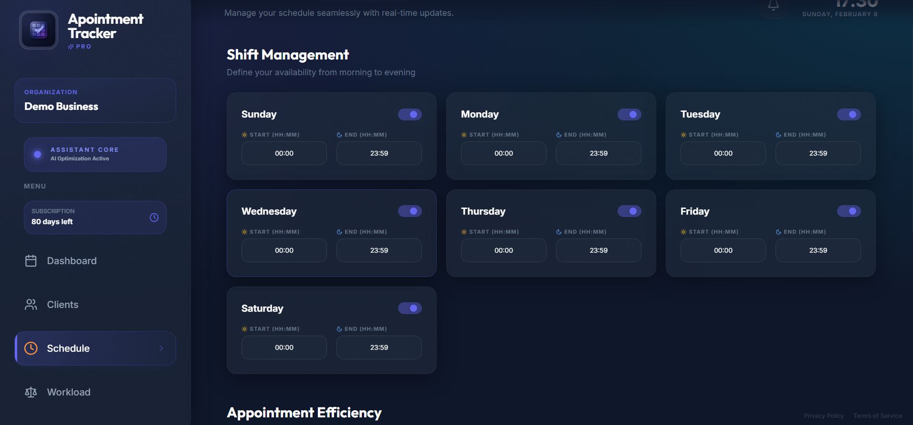
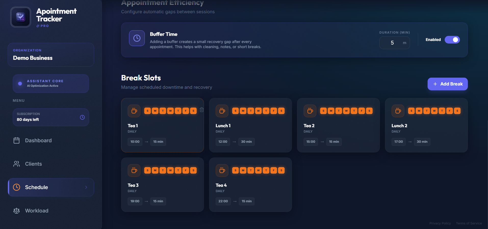

### 👤 Profile, Skills & Service Menu
Staff can manage their personal profiles, assigned skills (which dynamically filter available services), and view their personalized Treatment Menu.
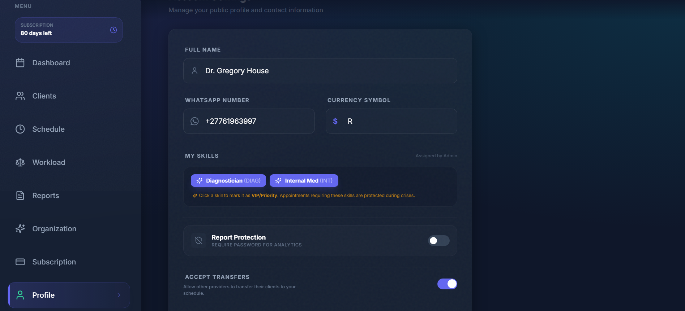
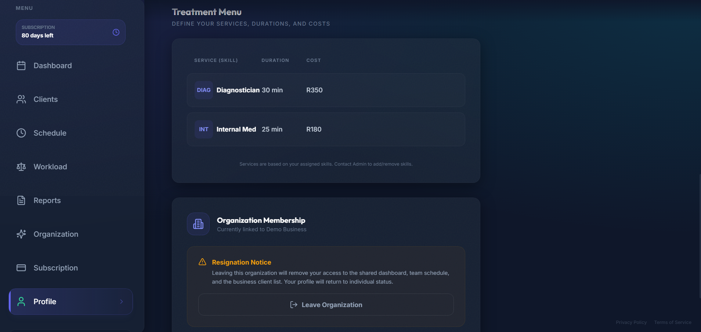

### 💳 Tiered Subscription System
Built-in support for monthly and yearly plans with automated tier management and grace period logic.
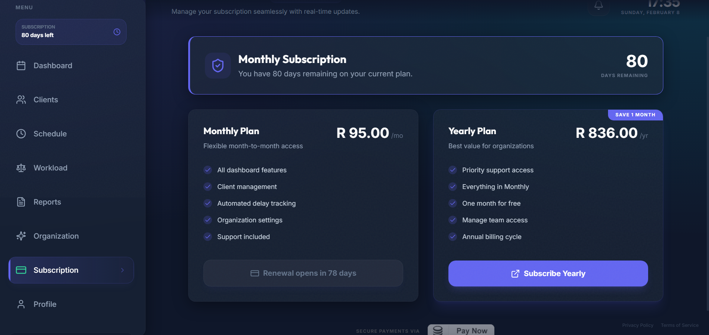

---

## 🌟 Key "Deal-Closing" Features

### 1. **Predictive Delay Modeling (The Radar)**
- Uses the `actual_start` vs `scheduled_start` to calculate a live "Ripple Effect."
- Automatically updates arrival times for subsequent clients and notifies them via WhatsApp.

### 2. **Skill-Locked Rebalancing**
- Staff are treated as a dynamic pool of **skills** (e.g., `['Surg', 'Neuro']`).
- The Balancer only suggests transfers to providers who meet the exact service requirements, ensuring zero drop in quality.

### 3. **Crisis Mode & Load Shedding**
- Triggered automatically when bottlenecks are detected.
- Admin receives a "Crisis Banner" with one-click "Approve" actions to move clients and save staff from burnout.

### 4. **Deep Audit Telemetry**
- Every action—from starting a session to transferring a client—is logged with micro-second precision for total operational transparency.

### 5. **Premium PWA Experience**
- Built as a Progressive Web App. Installable on Mobile/Desktop with offline-ready capabilities and push notification support.

---

## 🛠️ Technical Stack (The Engine)

- **Frontend**: React 18, Vite, Framer Motion (for fluid UI), Tailwind CSS.
- **Backend & Auth**: Supabase (Postgres) with heavily optimized Row Level Security (RLS).
- **Real-time**: Supabase Realtime for instant "no-refresh" synchronization across all devices.
- **Communication**: Custom Twilio Proxy for secure, automated WhatsApp notifications.
- **Storage & Backup**: Integrated Google Drive Backup system for audit logs and reporting.
- **Hosting**: Vercel (Edge-ready deployment).

---

## 📦 What's Inside?

A buyer of this platform gets more than just code; they get a battle-hardened operational system:
- **Scalable Database Schema**: Designed for multiple organizations and complex role hierarchies.
- **Demo Mode**: A fully functional "Hospital/Clinic" demo seeder for instant product demos.
- **Subscription Engine**: Integrated tier management (Monthly/Yearly) and "Subscription Amnesty" logic.
- **Shift Management**: Granular control over facility hours, break slots, and buffer times.

---

## ⚙️ Quick Start

1. **Clone & Install**:
   ```bash
   npm install
   ```
2. **Environment Setup**:
   Copy `.env.example` to `.env` and add your Supabase and Twilio credentials.
3. **Launch**:
   ```bash
   npm run dev
   ```

---

*Elevate your facility operations. Experience the power of Workload Intelligence.*  
**Developed by the Antigravity Team.**
